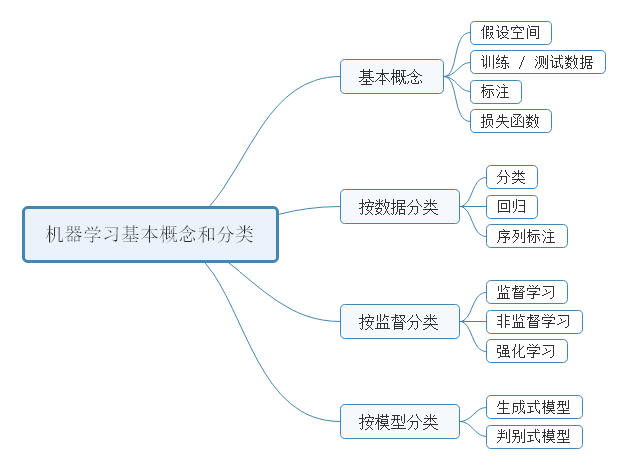
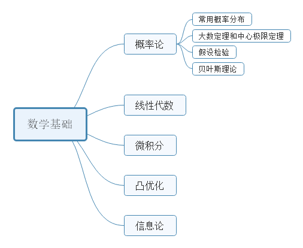
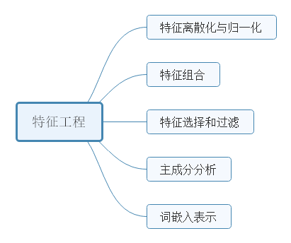
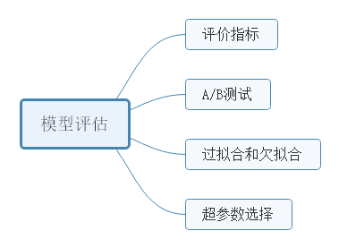
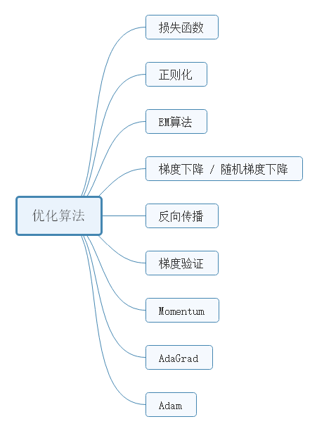
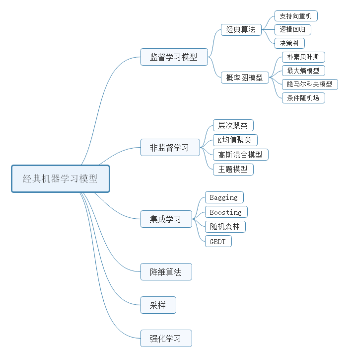
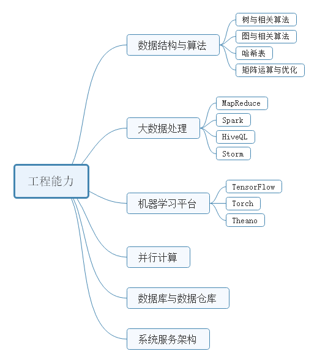
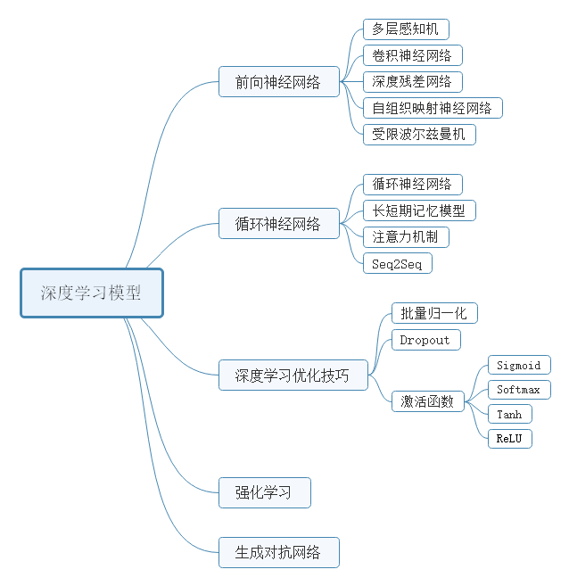
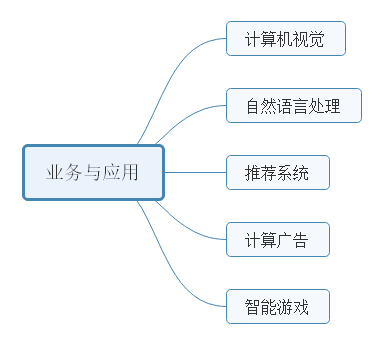

# 机器学习算法工程师
- 机器学习基本概念和分类   
- 数学基础   
- 特征工程   
- 模型评估   
- 优化算法  
- 经典机器学习模型   
- 工程能力      
- 深度学习模型  
- 业务与应用 
 
## 机器学习基本概念和分类    

## 数学基础   

## 特征工程

## 模型评估

## 优化算法

## 经典机器学习模型 

## 工程能力

## 深度学习模型

## 业务与应用

## Reference   
[Machine-Learning-Algorithms-Second-Edition](https://github.com/PacktPublishing/Machine-Learning-Algorithms-Second-Edition)

